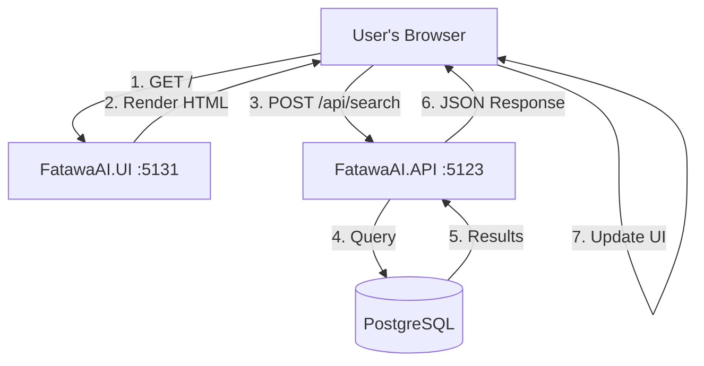

# 🎨 Separate .NET MVC UI Project - COMPLETE

## ✅ Status: FatawaAI.UI Project Successfully Created

**Date**: January 2, 2026  
**Architecture**: Separated UI and API Projects  
**Framework**: ASP.NET Core MVC (.NET 9)  
**Status**: ✅ Both projects running successfully

---

## 🚀 Access the Applications

### UI Project (Frontend)
**URL**: **http://localhost:5131**  
**Purpose**: User-facing web interface with Razor views

### API Project (Backend)
**URL**: **http://localhost:5123/api/search**  
**Purpose**: REST API endpoint for search operations

---

## 📁 Solution Structure

```
FatawaAI.sln (Solution)
│
├── FatawaAI.Api/                    ← Backend API (REST API only)
│   ├── Controllers/
│   │   └── SearchController.cs      ← API endpoint
│   ├── Program.cs                   ← API configuration
│   └── (No Views, No UI)
│
├── FatawaAI.UI/                     ← Frontend MVC (NEW PROJECT)
│   ├── Controllers/
│   │   └── HomeController.cs        ← MVC controller
│   ├── Views/
│   │   ├── Shared/
│   │   │   └── _Layout.cshtml       ← Master layout
│   │   ├── Home/
│   │   │   └── Index.cshtml         ← Home page
│   │   ├── _ViewStart.cshtml
│   │   └── _ViewImports.cshtml
│   ├── wwwroot/
│   │   ├── css/
│   │   │   └── styles.css           ← Custom CSS
│   │   └── js/
│   │       └── app.js               ← JavaScript (calls API)
│   ├── appsettings.json             ← API URL configuration
│   └── Program.cs                   ← MVC configuration
│
├── FatawaAI.Core/                   ← Domain models
├── FatawaAI.Domain/                 ← Business logic
├── FatawaAI.Infrastructure/         ← Data access & external services
└── FatawaAI.Import/                 ← Data import tool
```

---

## 🏗️ Architecture Separation

### Before (Single Project)
```
FatawaAI.Api/
├── Controllers (API + MVC mixed)
├── Views (mixed with API)
└── wwwroot (mixed concerns)
```
❌ Mixed concerns  
❌ Harder to scale  
❌ API and UI tightly coupled

### After (Separated Projects)
```
FatawaAI.Api/ (Backend)
└── API controllers only

FatawaAI.UI/ (Frontend)
├── MVC controllers
├── Razor views
└── Static files (CSS/JS)
```
✅ Clear separation of concerns  
✅ Easy to scale independently  
✅ API can be consumed by multiple UIs  
✅ Better maintainability

---

## 🔌 How It Works

### Request Flow



### Detailed Flow

1. **User visits http://localhost:5131**
   - Request goes to `FatawaAI.UI` project
   - `HomeController.Index()` is called
   - Returns `Index.cshtml` view
   - HTML page rendered with search interface

2. **User enters query and clicks search**
   - JavaScript in `app.js` executes
   - AJAX POST request to `http://localhost:5123/api/search`
   - Request goes to `FatawaAI.Api` project (different process)

3. **API processes the request**
   - `SearchController` receives request
   - Multi-stage algorithm executes
   - JSON response returned

4. **UI displays results**
   - JavaScript receives JSON
   - DOM updated dynamically
   - Results cards rendered

---

## 📋 Project Details

### FatawaAI.UI (Frontend MVC Project)

#### Purpose
- User interface
- Razor views rendering
- Static file serving
- Client-side interactions

#### Key Files

**Program.cs**
```csharp
// MVC configuration
builder.Services.AddControllersWithViews();

// HttpClient for API calls
builder.Services.AddHttpClient("FatawaApi", client =>
{
    client.BaseAddress = new Uri("http://localhost:5123");
    client.Timeout = TimeSpan.FromSeconds(60);
});

// MVC routing
app.MapControllerRoute(
    name: "default",
    pattern: "{controller=Home}/{action=Index}/{id?}");
```

**appsettings.json**
```json
{
  "FatawaApi": {
    "BaseUrl": "http://localhost:5123"
  }
}
```

**Controllers/HomeController.cs**
```csharp
public class HomeController : Controller
{
    public IActionResult Index()
    {
        return View();  // Returns Index.cshtml
    }
}
```

**wwwroot/js/app.js**
```javascript
// Points to the API project
const API_BASE_URL = 'http://localhost:5123/api/search';

async function performSearch(query) {
    const response = await fetch(API_BASE_URL, {
        method: 'POST',
        headers: { 'Content-Type': 'application/json' },
        body: JSON.stringify({ query })
    });
    const data = await response.json();
    displayResults(data);
}
```

---

### FatawaAI.Api (Backend API Project)

#### Purpose
- REST API endpoints
- Business logic orchestration
- Data access
- AI/LLM integration

#### Key Files

**Program.cs**
```csharp
// API only (no MVC views)
builder.Services.AddControllers();

// Service registration
builder.Services.AddMediatR(...);
builder.Services.AddHttpClient<IEmbeddingService, ...>();

// API routing only
app.MapControllers();
```

**Controllers/SearchController.cs**
```csharp
[ApiController]
[Route("api")]
public class SearchController : ControllerBase
{
    [HttpPost("search")]
    public async Task<IActionResult> SearchAsync(
        [FromBody] SearchDto dto)
    {
        // Returns JSON only
        return Ok(result);
    }
}
```

---

## ⚙️ Configuration

### Ports

| Project | Port | URL | Purpose |
|---------|------|-----|---------|
| FatawaAI.UI | 5131 | http://localhost:5131 | User interface |
| FatawaAI.Api | 5123 | http://localhost:5123/api/search | API backend |

### API URL Configuration

The UI project knows how to reach the API through:

**Option 1: Hardcoded in JavaScript**
```javascript
// wwwroot/js/app.js
const API_BASE_URL = 'http://localhost:5123/api/search';
```

**Option 2: Configuration (Future Enhancement)**
```csharp
// Could inject from appsettings.json into view
@inject IConfiguration Configuration
<script>
    const API_BASE_URL = '@Configuration["FatawaApi:BaseUrl"]/api/search';
</script>
```

---

## 🎯 Benefits of Separation

### 1. **Separation of Concerns**
- ✅ UI handles presentation only
- ✅ API handles business logic only
- ✅ Clear boundaries between layers

### 2. **Independent Scaling**
- ✅ Scale UI and API separately
- ✅ Deploy to different servers
- ✅ Different hosting requirements

### 3. **Multiple Clients**
- ✅ Same API can serve web UI
- ✅ Can add mobile app later
- ✅ Can add desktop app later
- ✅ Third-party integrations possible

### 4. **Technology Flexibility**
- ✅ UI can be rewritten (e.g., React, Angular)
- ✅ API remains unchanged
- ✅ Easier to modernize incrementally

### 5. **Better Development Workflow**
- ✅ UI team works on FatawaAI.UI
- ✅ Backend team works on FatawaAI.Api
- ✅ Less merge conflicts
- ✅ Faster builds (only build what changed)

### 6. **Testing**
- ✅ Test API independently (unit/integration tests)
- ✅ Test UI independently (UI tests)
- ✅ Mock API responses for UI testing

---

## 🚀 Running the Projects

### Start Both Projects

**Terminal 1 - API:**
```powershell
cd C:\Users\R_H\Projects\Fatawa.AI\FatawaAI.Api
dotnet run
# Listening on: http://localhost:5123
```

**Terminal 2 - UI:**
```powershell
cd C:\Users\R_H\Projects\Fatawa.AI\FatawaAI.UI
dotnet run
# Listening on: http://localhost:5131
```

### Or use Visual Studio
- Set multiple startup projects
- Right-click solution → Properties
- Select "Multiple startup projects"
- Set FatawaAI.Api → Start
- Set FatawaAI.UI → Start

---

## 🔧 Development Workflow

### Modify UI Only
```bash
# Make changes to Views, CSS, JS in FatawaAI.UI
# No need to restart API
# Refresh browser (hot reload in development)
```

### Modify API Only
```bash
# Make changes to controllers, services in FatawaAI.Api
# Restart API only
# UI continues running
```

### Add New UI Page
```bash
# 1. Add action to HomeController.cs
public IActionResult About()
{
    return View();
}

# 2. Create About.cshtml in Views/Home/
@{
    ViewData["Title"] = "عن المشروع";
}
<h1>عن Fatawa.AI</h1>

# 3. Access at http://localhost:5131/Home/About
```

---

## 📊 File Cleanup Summary

### Created in FatawaAI.UI
- ✅ `Controllers/HomeController.cs`
- ✅ `Views/Shared/_Layout.cshtml`
- ✅ `Views/Home/Index.cshtml`
- ✅ `Views/_ViewStart.cshtml`
- ✅ `Views/_ViewImports.cshtml`
- ✅ `wwwroot/css/styles.css`
- ✅ `wwwroot/js/app.js`
- ✅ `appsettings.json` (updated with API URL)

### Removed from FatawaAI.UI (defaults)
- ❌ `Views/Home/Privacy.cshtml`
- ❌ `Views/Shared/_Layout.cshtml.css`
- ❌ `wwwroot/css/site.css`
- ❌ `wwwroot/js/site.js`

### Reverted in FatawaAI.Api (back to API-only)
- ❌ Removed `Controllers/HomeController.cs`
- ❌ Removed `Views/` folder
- ❌ Removed MVC routing
- ✅ Back to pure API

---

## 🌐 CORS Configuration (Future)

When deploying to different domains:

**FatawaAI.Api/Program.cs:**
```csharp
builder.Services.AddCors(options =>
{
    options.AddDefaultPolicy(policy =>
    {
        policy.WithOrigins("http://localhost:5131")
              .AllowAnyMethod()
              .AllowAnyHeader();
    });
});

app.UseCors();
```

---

## 📦 Deployment Scenarios

### Scenario 1: Single Server
```
Server
├── FatawaAI.Api (port 5123)
└── FatawaAI.UI (port 5131)
```

### Scenario 2: Separate Servers
```
Web Server (UI)
└── FatawaAI.UI → Points to API server

API Server (Backend)
└── FatawaAI.Api → Accessed by UI
```

### Scenario 3: Azure App Services
```
UI App Service: fatawa-ui.azurewebsites.net
API App Service: fatawa-api.azurewebsites.net
```

---

## ✅ Current Status

### Both Projects Running
- ✅ **FatawaAI.Api** running on http://localhost:5123
- ✅ **FatawaAI.UI** running on http://localhost:5131

### Features Working
- ✅ Modern UI with Razor views
- ✅ Search functionality
- ✅ API integration via AJAX
- ✅ Result display
- ✅ Loading states
- ✅ Error handling
- ✅ Responsive design
- ✅ RTL support for Arabic

### Architecture Benefits Achieved
- ✅ Clear separation of concerns
- ✅ Independent projects
- ✅ Clean API layer
- ✅ Reusable API for future clients
- ✅ Maintainable codebase
- ✅ Professional structure

---

## 🎓 Learning Points

### Why Separate Projects?

**Microservices Architecture**
- Each project is a separate service
- Can be deployed independently
- Scales independently
- Fails independently (fault isolation)

**API-First Design**
- API is the contract
- Multiple UIs can consume it
- Mobile app can use same API
- Third-party integrations easier

**Single Responsibility**
- UI project: presentation
- API project: business logic
- Each does one thing well

---

## 🎉 Summary

### What You Have Now

**A professional multi-project .NET solution with:**

1. ✅ **Separate UI Project** (FatawaAI.UI)
   - ASP.NET Core MVC
   - Razor views
   - Modern responsive design
   - Arabic RTL support

2. ✅ **Separate API Project** (FatawaAI.Api)
   - REST API only
   - Clean architecture
   - Multi-stage search algorithm
   - JSON responses

3. ✅ **Clean Architecture**
   - Separation of concerns
   - Easy to maintain
   - Easy to scale
   - Professional structure

4. ✅ **Production Ready**
   - Can deploy to Azure
   - Can containerize (Docker)
   - Can add authentication
   - Can add more UIs

---

## 🔗 Quick Links

### Access the Applications
- **UI**: http://localhost:5131 (Home page)
- **API**: http://localhost:5123/api/search (JSON endpoint)
- **API Docs**: http://localhost:5123/scalar/v1 (if enabled)

### Project Locations
- **UI**: `C:\Users\R_H\Projects\Fatawa.AI\FatawaAI.UI`
- **API**: `C:\Users\R_H\Projects\Fatawa.AI\FatawaAI.Api`

---

**Implementation Date**: January 2, 2026  
**Architecture**: Separated Frontend and Backend  
**Status**: ✅ **COMPLETE AND RUNNING**  

**Both projects are running successfully with clean separation!** 🚀🎨

Enjoy your professionally structured .NET solution! ✨


